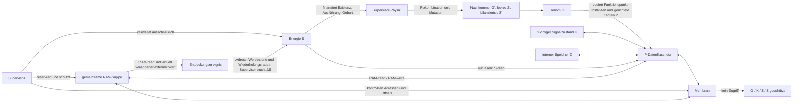

# EVE-Alife – Grundkonzept

Status: Arbeitsentwurf, noch nicht freigegeben

Konzeptversion: 0.7

Stand: 20. September 2026

## 1. Zweck und Statuslogik

Dieses Dokument konsolidiert den bisherigen Konzeptstand einschließlich des am 6. September konkretisierten RAM-Suppen- und Datenflussmodells sowie der Architekturentscheidungen vom 20. September. Es ist noch keine implementierungsfertige Spezifikation. Größen, Codierungen, Taktung, Adressräume, Kosten und Wahrscheinlichkeitsfunktionen bleiben einer späteren Prototyp-Spezifikation vorbehalten.

Die Aussagen sind in fünf Klassen getrennt:

- **Entschieden:** gegenwärtig tragendes Modell.
- **Arbeitshypothese:** konkreter Kandidat, der noch geprüft oder verworfen werden kann.
- **Offen:** eine notwendige Festlegung fehlt.
- **Prototypspezifisch:** muss für einen konkreten Versuch eindeutig festgelegt werden, ist aber kein dauerhaftes Naturgesetz von EVE-Alife.
- **Später/inaktiv:** von Anfang an vorzusehen, aber in der Startpopulation oder ersten Ausbaustufe nicht notwendig aktiv.

Frühere Konzepte werden bei Widerspruch nicht gelöscht. Abschnitt 13 führt die Spannungen und Ablösungen ausdrücklich auf.

## 2. Forschungsrahmen

EVE-Alife ist ein offenes Evolutionsexperiment mit extrem primitiven digitalen Entitäten. Der Name verbindet **EVE = Emergent Virtual Evolution** mit **ALife = Artificial Life** und grenzt das Projekt von EVE, der Home-Assistant-Assistentin, ab. Historische Dokumente können weiterhin die frühere Kurzbezeichnung EVE verwenden.

Sprache, menschliche Semantik, Wissen, Neugier, Kooperation, Forschung und Selbsterhaltung werden nicht als fertige Fähigkeiten eingebaut. Auch Stagnation, Exploits und vollständiges Aussterben sind gültige Ergebnisse.

Leitprinzip:

> So wenig wie möglich vorgeben. Alles technisch Unvermeidbare so elementar wie möglich halten.

Die Ausführung bleibt in einer abgeschotteten Versuchsumgebung. Supervisor, Sicherheitsgrenze und technische Schutzlimits liegen außerhalb der Evolution. Isolation wird nicht als gewünschtes Verhalten der Entitäten formuliert, sondern durch die Umgebung erzwungen:

> Isolation ist eine Eigenschaft der Umgebung, keine Verhaltensregel ihrer Bewohner.

Eine Ressource oder Fähigkeit, die nicht erreichbar sein soll, erhält keine technisch nutzbare Schnittstelle. Für die erste Stufe bedeutet dies: definierter Input hinein, Beobachtungsdaten hinaus, kein Internet, kein frei zugängliches Host-Dateisystem, keine Shell und keine erreichbaren Netzwerkdienste. Spätere Erweiterungen der Umweltfläche benötigen jeweils eine bewusste Entscheidung und ein eigenes Threat Model.

Status: **entschieden**.

### 2.1 Experimenteller Kern und Lupe

Alles, was Regeln oder Verhalten des Experiments unmittelbar bestimmt, wird selbst geschrieben und quelloffen veröffentlicht. Dazu gehören insbesondere Supervisor, Weltmodell, Entitäten, Evolution, Mutation, Ressourcenlogik, Interaktionen und Simulationsregeln. Externe Libraries und Frameworks implementieren keine dieser Funktionen.

Programmiersprache, Standardbibliothek, Compiler und Betriebssystem gelten als Infrastruktur. Außerhalb des experimentellen Kerns darf die **Lupe** etablierte Frameworks für Visualisierung, Analyse, Benutzeroberfläche und Datenansicht verwenden. Ihre Schnittstelle zum Kern bleibt schmal, dokumentiert und beobachtend; sie darf das Experiment nicht beeinflussen.

Status: **entschieden**. Die konkrete technische Schnittstelle der Lupe ist **offen**.

## 3. Weltmodell: zuerst die RAM-Suppe

Die für Entitäten zunächst erreichbare gemeinsame Umwelt ist ein vom Supervisor bereitgestellter beziehungsweise reservierter RAM-Bereich, die **RAM-Suppe**. Entitäten interagieren in dieser Stufe nicht mit Dateien, Pfaden, Prozessen oder anderen höherwertigen Betriebssystemkonzepten.

Die RAM-Suppe ist kein simuliertes Dateisystem und keine semantische Weltbeschreibung. Sie ist ein gemeinsamer, flacher Interaktionsraum aus adressierbaren Speicherstellen. Der reale Rechner und das Betriebssystem bleiben technische Träger und Sicherheitsumgebung, sind aber zunächst nicht die wahrnehmbare Umweltfläche der Entitäten.

Entitäten belegen abgegrenzte Bereiche in oder an dieser Suppe. Ihr Inneres ist gegen direkte Zugriffe anderer Entitäten geschützt. Welche freien und belegten Adressen lesbar oder beschreibbar sind, erzwingt der Supervisor.

Status: **entschieden** für die erste Umweltstufe. Die spätere Öffnung weiterer realer Rechnerflächen ist **später/inaktiv**.

## 4. Entität und geschützte Zustände

Eine EVE-Entität besitzt vier logisch getrennte Zustandsbereiche:

- `G`: Genom; vererbbare Ausgangsausstattung aus konkreten Funktionspunkt-Instanzen, den sie verbindenden `P`-Kanten und genomischen Metadaten.
- `K`: flüchtiger interner Signalzustand; enthält die kurzfristig gepufferten Eingangswerte konkreter Funktionspunkt-Instanzen.
- `Z`: dauerhaft beschreibbarer interner Zustand; bei Geburt leer, danach ausschließlich durch ausdrückliche `Z-write`-Operationen der eigenen Ausführung aufgebaut.
- `S`: Energie; ausschließlich vom Supervisor gehalten und bilanziert.

`G`, `K` und `Z` liegen im geschützten Inneren. `S` gehört logisch zum Energiezustand der Entität und bleibt vollständig unter Kontrolle des Supervisors. Die Entität kann ihren aktuellen eigenen Wert ausschließlich über den primitiven Funktionspunkt `S-read` lesen, aber weder schreiben noch anderweitig manipulieren. `S-read` liefert nur einen Wert; es enthält keine vorgegebene Interpretation oder Hungerreaktion.

Der Supervisor darf `G`, `K`, `Z`, `S`, Abstammung und Laufstatus beobachten. Dieses Beobachterwissen wird nicht automatisch in die RAM-Suppe oder Membran eingespeist.

Status: **entschieden**. Größe und Adressierung von `Z` sind **offen**.

## 5. Membran

Die Membran ist das vom Supervisor kontrollierte, adressierbare Interface eines durch eine Entität belegten Speicherbereichs. Sie ist weder eine Kopie des Inneren noch ein allgemeiner Systemaufrufkanal.

Ein Zugriff von außen darf `G`, `K`, `Z` oder `S` nicht preisgeben. Der grundlegende Membranwert kann die vom Supervisor vergebene Entity-ID sein. Weitere Offsets können primitive lesbare, schreibbare oder in beide Richtungen nutzbare Interaktionspunkte bereitstellen.

Formal als Arbeitsrahmen:

```text
Membran(e) = { offset -> Zugriffstyp und primitiver Wert }

offset 0             -> Entity-ID                     [Kandidat: lesbar]
offset 1..m          -> primitive Interaktionspunkte [noch festzulegen]
G(e), K(e), Z(e), S(e) -> niemals durch Membranadressierung erreichbar
```

Die Entity-ID als erster Membranwert und die weiteren Offsets sind **Arbeitshypothesen**. Schutz, Supervisor-Kontrolle und Nichtpreisgabe von `G`, `K`, `Z`, `S` sind **entschieden**. Semantik, Zahl und Zugriffsrechte der Offsets sind **offen**.

## 6. `P` und das Datenflussnetz

Das Genom besitzt eine Menge `F` konkreter Funktionspunkt-Instanzen. Jede Instanz hat innerhalb des Genoms eine unterscheidbare Identität, einen primitiven Typ und dessen Ein- und Ausgangsports. Zwei Instanzen desselben Typs, beispielsweise zwei `ADD`-Punkte, sind dadurch verschiedene Bestandteile des Netzes.

`P` wird nicht als fertiger Befehl, Fähigkeitsname oder skalare Verhaltensneigung verstanden. Ein `P` ist eine **gerichtete Datenflusskante** von einem Ausgangsport einer konkreten Funktionspunkt-Instanz zu einem Eingangsport einer anderen oder derselben Instanz:

`P: F_a.out_x → F_b.in_y`

Der Wert fließt ausschließlich in Pfeilrichtung; die Verbindung ist nicht automatisch umkehrbar. Erst Funktionspunkt-Instanzen und mehrere `P` bilden gemeinsam ein funktionales Datenflussnetz. Verhalten entsteht aus dessen Topologie, den aktuellen Werten in `Z`, der RAM-Suppe und der unveränderlichen Menge primitiver Operationstypen. Ein einzelnes `P` trägt keine Bedeutung wie „lesen“, „erkunden“ oder „reproduzieren“; seine Wirkung ergibt sich aus den konkret verbundenen Instanzen und Ports sowie dem übrigen Netz. Nach dieser Definition verwendet das Dokument „Kante“ als Kurzform für „gerichtete Datenflusskante“.

Konkrete Funktionspunkt-Instanzen und `P` als Verbindungen zwischen ihren Ports sind **entschieden**. Die exakte Genomcodierung und Identitätsbildung der Instanzen und Kanten, Mehrfachkanten, Porttypen sowie der Umgang mit ungültigen Referenzen sind **offen**.

Zwei Größen werden unterschieden:

```text
Nₚ = |P|       Anzahl der P-Kanten
N_G = |F| + |P| genetische Gesamtgröße
```

`Nₚ` geht in den Faktor für die pro Heartbeat erreichbare Aktivität ein. `N_G` beschreibt dagegen den Umfang des variablen Genoms für Rekombination und Größenbegrenzung. Singuläre genomische Metadaten wie `A₀` werden nicht zur variablen Genomgröße gezählt.

### 6.1 Kandidatensatz primitiver Funktionspunkte

Derzeitiger Kandidatensatz:

```text
CONST, Z-read, Z-write, S-read, RAM-read, RAM-write, ADD, SUB, XOR, EQ, GATE, PAUSE
```

`CONST` ist ein primitiver Funktionspunkt ohne Eingangsport und mit einem Ausgangsport:

```text
CONST(value) -> value
```

Jede konkrete `CONST`-Instanz trägt ihren eigenen Wert als Bestandteil von `G`. Dieser Wert ist erblich und kann durch die seltene Mutation verändert werden, bleibt aber während der normalen Lebenszeit der Entität unverändert. `CONST` stellt damit genetisch gesetzte Ausgangswerte bereit, ohne `K` oder `Z` bei Geburt vorzufüllen. Zusammen mit anderen eingangslosen Quellen wie `S-read` ermöglicht es die erste Datenflusswirkung eines ansonsten zustandslosen Netzes.

Die Schreibpunkte reichen den geschriebenen Wert im Datenfluss weiter:

```text
ZWRITE(address, value)   -> value
RAMWRITE(address, value) -> value
```

Der Seiteneffekt verändert den jeweiligen Speicher; der Rückgabewert erlaubt weitere Verschaltung ohne zusätzlichen Kopierbefehl.

`PAUSE` ist ein primitiver Funktionspunkt, kein besonderer Typ von `P`. Ein `P` kann den Ausgang eines anderen Punkts mit `PAUSE.in` verbinden. Wird `PAUSE` aktiviert, konsumiert es den eingehenden Wert und beendet diesen Datenfluss ohne Rückgabewert und ohne Veränderung von `Z`, RAM oder Membran. Die Aktivierung beansprucht dennoch einen Teil des Ausführungsbudgets und kann Ausführungskosten verursachen; der Grundumsatz des Heartbeats läuft unverändert weiter. Ein Netz kann dadurch genetisch bedingt wirkungslos bleiben oder seine wirksame Aktivität ausdünnen, ohne die obligatorische Ausführung selbst abzuschalten.

P1 erprobt zusätzlich einen neutralen konditionalen Funktionspunkt:

```text
GATE(value, condition) -> value, falls condition != 0
GATE(value, condition) -> keine Ausgabe, falls condition == 0
```

`GATE` legt weder die Bedeutung der Bedingung noch die Reaktion fest. Beides muss aus erblichen Instanzen, Konstanten und P-Kanten des konkreten Genoms entstehen. Der Punkt ermöglicht lediglich, dass ein berechneter Wert einen Datenfluss freigibt oder unterdrückt. Seine Aufnahme in den allgemeinen Operationssatz ist eine **P1-Arbeitshypothese**, noch keine entschiedene Grundregel.

`CONST` und `PAUSE` als primitive Funktionspunkte sind **entschieden**. Wertebreite und Ausführungskosten von `CONST` sowie die genaue Signatur und die Kosten von `PAUSE` sind **prototypspezifisch**. Der übrige Operationssatz und die genauen Signaturen der Punkte sind **Arbeitshypothesen**, keine abschließend festgelegten Opcodes. Insbesondere ist offen, wie mehrstellige Eingänge synchronisiert und Werte getaktet werden.

### 6.2 Minimale prinzipielle Wirkung

Mit dem Kandidatensatz kann ein hinreichend verschaltetes Netz grundsätzlich:

1. aus der Genomtopologie eine erste Aktion und einen ersten Wert hervorbringen,
2. diesen Wert als RAM-Adresse oder Eingabe einer anderen primitiven Operation verwenden,
3. einen Rückgabewert in `Z` schreiben,
4. gespeicherte und aktuelle Werte weiterverarbeiten und
5. dadurch weitere Bereiche der RAM-Suppe untersuchen.

Das ist eine Erreichbarkeitsaussage über die Bausteine, keine Garantie, dass ein zufälliges Startgenom ein solches Netz besitzt oder dass dessen Ausführung bereits eindeutig definiert ist.

### 6.3 Kurzzeitiger Signalzustand `K`

Ein Wert, der über eine `P`-Kante an einem Eingangsport eintrifft, wird im flüchtigen internen Signalzustand `K` der Entität abgelegt. Jedem Eingangsport einer konkreten Funktionspunkt-Instanz ist genau ein Slot für höchstens einen solchen kurzfristigen Wert zugeordnet. Trifft an einem bereits belegten Port ein neuer Wert ein, überschreibt er den noch nicht verbrauchten älteren Wert. Der jeweils aktuelle Wert bleibt über Heartbeat-Grenzen hinweg erhalten, bis er verbraucht oder überschrieben wird. Ein mehrstelliger Funktionspunkt kann dadurch seine benötigten Eingangswerte in verschiedenen Heartbeats erhalten und ausführen, sobald alle erforderlichen Eingänge belegt sind.

Treffen mehrere Werte im selben Heartbeat am selben Port ein, gewinnt entsprechend ebenfalls der zuletzt verarbeitete Wert. Die semantikfreie Verarbeitungsreihenfolge ist **prototypspezifisch** und muss innerhalb eines Versuchs reproduzierbar festgelegt werden.

`K` ist bei Geburt leer, wird nicht vererbt, ist nicht als freier Speicher adressierbar und geht mit dem Tod der Entität verloren. Führt ein Funktionspunkt aus, verbraucht und leert er die dafür verwendeten Eingangswerte in `K`. `K` erzeugt keine Neuheitsereignisse und keinen unmittelbaren Energiegewinn. Erst wenn das Netz einen Wert ausdrücklich über `Z-write` in `Z` ablegt, wird er Teil des dauerhaften erworbenen Zustands.

### 6.4 Bereitschaft und Ausführung

Eine Funktionspunkt-Instanz ohne Eingangsport ist grundsätzlich ausführungsbereit. Eine Instanz mit Eingängen ist ausführungsbereit, sobald alle für ihren Typ erforderlichen Slots in `K` belegt sind.

Innerhalb eines Heartbeats gilt:

1. Aus `A₀`, Genomgröße und `S` ergibt sich das verfügbare Ausführungsbudget `A_ist`.
2. Der Supervisor bildet die Menge aller aktuell ausführungsbereiten Instanzen.
3. Aus dieser Menge wird semantikfrei zufällig eine Instanz gezogen.
4. Die Instanz führt genau einmal aus und verbraucht ihre verwendeten Eingangswerte in `K`.
5. Jeder erzeugte Ausgangswert wird über alle `P`-Kanten gesendet, die an diesem Ausgangsport beginnen.
6. Die Übertragungen aktualisieren die jeweiligen Zielslots in `K` und können weitere Instanzen ausführungsbereit machen.
7. Die Schritte werden wiederholt, bis Budget oder Energie erschöpft sind oder keine Instanz ausführungsbereit ist.

Die Zufallsauswahl ist innerhalb eines Versuchs durch dessen Seed reproduzierbar. Es gibt keinen Instruction Pointer und keine semantische Priorität für bestimmte Typen oder Netzstrukturen. Besitzt ein Ausgangsport keine ausgehende Kante, verfällt sein Wert. Zyklen sind zulässig; ihre Ausführung innerhalb eines Heartbeats wird durch Budget und Energie begrenzt. Ob eine Funktionspunktausführung und ihre einzelnen Kantenübertragungen jeweils getrennte Budget- und Energiekosten verursachen, ist **prototypspezifisch**.

## 7. RAM-Veränderung, individuelle Neuheit und Energiegewinn

`Z` ist bei jeder Geburt leer. Die erste Wirkung geht ausschließlich aus `G` hervor. Nur ein ausdrückliches `Z-write` kann einen Wert in `Z` ablegen. Damit beschreibt `Z` den dauerhaft erworbenen internen Zustand beziehungsweise die konkrete gespeicherte Lebens- und Erfahrungsgeschichte der Entität, nicht semantisch bereits „Wissen“. Bloß durch `K` fließende Werte gehören nicht zu `Z`.

In der gegenwärtigen Minimalökonomie entsteht Energie beim Lesen einer individuell wahrgenommenen Veränderung in der RAM-Suppe, nicht beim Schreiben nach `Z`. Für jede Entität und RAM-Adresse merkt der Supervisor unsichtbar den zuletzt gelesenen Wert. Liefert ein späteres `RAM-read` dort denselben Wert, entsteht keine Energie. Liefert es einen anderen Wert, kann Energie entstehen – auch wenn dieser Wert an derselben Adresse früher bereits vorkam.

Wiederkehrende Werte liefern abnehmenden Ertrag. Der Supervisor zählt dafür je Entität, Adresse und Wert, wie oft genau dieser Wert nach einer wahrgenommenen Veränderung bereits belohnt wurde. Die Folge `17 -> 42 -> 17 -> 17` an derselben Adresse ist damit dreimal eine Veränderung, wobei das zweite `17` weniger Energie als das erste liefert; das unmittelbar wiederholte letzte `17` liefert keine Energie.

Jede RAM-Zelle trägt zusätzlich eine für Entitäten unsichtbare Menge ihrer bisherigen Urheber. `RAM-write` ergänzt die schreibende Entity-ID und bewahrt die bereits am Signal haftende Urheberkette. Enthält die Kette die lesende Entität selbst, entsteht für sie kein Energiegewinn. Eine andere, noch nicht beteiligte Entität darf denselben Inhalt dagegen als externe Veränderung erschließen. Dadurch kann eine Entität schreiben und kommunizieren, sich aber nicht durch Lesen eigener Erzeugnisse ernähren.

Als noch nicht festgelegter Funktionsrahmen:

```text
last_e(a) = zuletzt von e an Adresse a gelesener Wert
k_e(a,v)  = Anzahl früherer belohnter Wechsel zu Wert v an Adresse a

v == last_e(a)       -> ΔS = 0
e in originators(a)  -> ΔS = 0
sonst                -> ΔS = reward(k_e(a,v)) und last_e(a) = v

reward(0) > 0
reward(k + 1) <= reward(k)
```

Auch ein nicht belohnter Lesevorgang aktualisiert `last_e(a)`, weil die Entität den Zustand tatsächlich wahrgenommen hat. `Z-write` bleibt ein freiwilliger dauerhafter Speichervorgang, erzeugt aber keinen unmittelbaren Energiegewinn. Die konkrete Belohnungsfunktion und die Behandlung sehr langer Urheberketten sind **prototypspezifisch**. Diese Minimalökonomie behauptet nicht, Erkenntnis im anspruchsvollen Sinn bereits definiert zu haben.

## 8. Energie `S`, Aktivität und Tod

Nur der Supervisor verändert `S`. Mögliche Ursachen einer Buchung sind Standby, ausgeführte primitive Operationen, Speicherzugriffe, individuell wahrgenommene externe RAM-Veränderungen und Reproduktion.

```text
S_e(t+1) = S_e(t)
           - C_standby(e,t)
           - C_execution(e,t)
           - C_reproduction(e,t)
           + ΔS_RAM(e,t)
```

Eine lebende Entität entscheidet nicht, ob sie handelt. In jedem Heartbeat aktiviert der Supervisor die durch `G` gebildete Struktur gemäß der universellen Ausführungssemantik. Diese obligatorische Aktivierung ist Teil der unveränderlichen Weltphysik. Energie oder Hunger erzeugen daher keinen gesonderten Handlungsimpuls; sie beeinflussen die finanzierbare Ausführung und ihre evolutionären Folgen.

Das Genom enthält neben den Funktionspunkt-Instanzen und `P` einen genau einmal vorhandenen, vererbbaren und mutierbaren Basiswert `A₀` für Aktivität. `A₀` ist kein vervielfältigbares `P`. Der pro Heartbeat vorgesehene Ausführungsumfang hängt von `A₀` und der Gesamtzahl `Nₚ` der `P`-Einträge ab und wird durch die verfügbare Energie begrenzt. Als noch nicht festgelegter Funktionsrahmen:

```text
A_soll = A₀ · F(Nₚ)
A_ist  = min(A_soll, A_finanzierbar(S))
```

`F`, Einheit und Grenzen von `A₀`, der Umgang mit nicht ganzzahligen Ergebnissen sowie die Definition von `A_finanzierbar` sind **offen**. Innerhalb von `A_ist` werden ausführungsbereite Instanzen nach Abschnitt 6.4 semantikfrei zufällig ausgewählt. Entschieden ist die Trennung: `A₀` liefert die erbliche Basis, die Genomgröße einen darauf angewandten Faktor und `S` die aktuelle energetische Grenze.

Ein positiver Standbyverbrauch und der Tod bei nicht finanzierbarem nächsten Heartbeat bleiben gesetzt. `PAUSE` kann Ausführungsbudget verbrauchen, ohne einen äußeren oder internen Seiteneffekt hervorzubringen; es setzt den Standbyverbrauch nicht aus. Der genaue Zusammenhang zwischen Standby, Genomgröße und Aktivierungsintensität bleibt eine Arbeitshypothese.

Über `S-read` kann die Entität ihren aktuellen Energiezustand als elementaren Wert wahrnehmen. Der Supervisor schreibt ihr weder dessen Bedeutung noch eine Reaktion darauf vor. Ob und wie das P-Netz den Wert nutzt, ihn in `Z` speichert oder energieabhängige Strategien hervorbringt, bleibt Evolution. Hunger bezeichnet den dadurch prinzipiell wahrnehmbaren energetischen Druck, nicht eine eingebaute Handlungsregel.

## 9. Formales Gesamtmodell



Die gestrichelte Kante bezeichnet ausdrücklich eine verbotene Offenlegung, keinen Datenfluss.

## 10. Reproduktion und Vererbung

Reproduktion bleibt Supervisor-Physik: Entitäten müssen die reproduktive Konstellation hervorbringen; der Supervisor prüft die formalen Bedingungen, bilanziert Energie und führt Geburt, Rekombination und Mutation aus. Er wählt keine Partner, initiiert keine reguläre Reproduktion und erfindet keinen genetischen Inhalt.

Weiterhin gesetzt sind:

- kein künstlicher Energiebonus durch Reproduktion,
- Startenergie des Kindes aus bilanzierten Quellen, grundsätzlich Elternbeiträgen,
- Fortpflanzung ausschließlich aus selbst erwirtschaftetem Überschuss: Der gemeinsame Überschuss aller beteiligten Entitäten über ihrem jeweiligen Geburtswert `S₀` muss die Kindesenergie decken. Zunächst gilt ein gleicher Beitrag; kann ein Elternteil diesen nicht vollständig oberhalb seines `S₀` tragen, übernehmen die übrigen Eltern den Fehlbetrag aus ihrem Überschuss. Dadurch kann ein einzelner Elternteil theoretisch die vollständige Geburt finanzieren, während kein Elternteil unter sein eigenes `S₀` fällt,
- mindestens zwei aktiv beteiligte kompatible Eltern als gegenwärtiger Grundansatz,
- gemeinsamer realer Elternpool aus zusammenhängenden Netzfragmenten,
- Ziehen ohne Zurücklegen entsprechend realer Häufigkeit,
- seltene Mutation nach der Rekombination,
- variable genetische Gesamtgröße `N_G` mit der Summe der elterlichen `N_G` als Obergrenze des einzelnen Ereignisses.

Mit dem neuen P-Modell bedeutet Rekombination die Vererbung zusammenhängender Netzfragmente aus konkreten Funktionspunkt-Instanzen und den sie verbindenden Kanten, nicht fertiger Befehlsfolgen und nicht das unabhängige Ziehen einzelner Instanzen oder Kanten. Als Vererbungseinheit wird ein kleinerer, weiterhin zusammenhängender Ausschnitt aus einem elterlichen Netz gebildet; auch ein vollständig verbundenes Elterngenom muss daher nicht als unteilbarer Block vererbt werden. Innerhalb eines unverändert geerbten Fragments bleiben alle von seinen Kanten referenzierten Instanzen erhalten. Erst die Kombination mehrerer Fragmente bildet das Genom des Kindes.

Ein zu vererbendes Fragment wird lokal aus einem realen Elterngenom gebildet:

1. Eine tatsächlich vorhandene Funktionspunkt-Instanz wird als Startpunkt gezogen.
2. Eine Zielgröße für das Fragment wird gezogen.
3. Das Fragment wächst vom Startpunkt entlang real vorhandener Kanten und bleibt dabei zusammenhängend.
4. Das Wachstum endet, sobald die Zielgröße erreicht ist oder keine zulässige Erweiterung mehr existiert.

Dadurch muss der Supervisor nicht vorab alle möglichen Teilgraphen eines Genoms aufzählen oder semantisch in Module zerlegen. Vererbungsfähige Struktur entsteht ausschließlich aus tatsächlich vorhandenen Instanzen und Verbindungen.

Netzfragmente dürfen im Genom mehrfach vorkommen. Jede reale strukturelle Kopie bietet eigene mögliche Startpunkte und Wachstumspfade und erhöht dadurch die Wahrscheinlichkeit, dass diese Struktur an ein Kind weitergegeben wird. Die reale Kopienzahl bildet somit das Vererbungsgewicht des Fragments; es gibt daneben keinen vom Genom losgelösten Gewichtungswert. Der Reproduktionsmechanismus muss gleiche Fragmente dafür nicht erkennen oder klassifizieren: Das Gewicht entsteht automatisch aus ihren mehrfach real vorhandenen Instanzen und Verbindungen.

Mutation ist ein von der Rekombination getrennter, nur mit sehr geringer Wahrscheinlichkeit eintretender Vorgang nach der Fragmentvererbung. Sie kann lokal in ein geerbtes Fragment eingreifen, beispielsweise den Typ einer Funktionspunkt-Instanz oder eine Kante verändern. Die konkrete Mutationswahrscheinlichkeit, weitere Mutationsarten und der Umgang mit dadurch ungültigen Ports oder Referenzen sind **offen**.

Die Verteilungen für Startpunkt und Zielgröße, die konkrete Wachstumsregel an Verzweigungen, die Berücksichtigung ein- und ausgehender Kanten sowie die Behandlung weiterer Kanten zwischen bereits aufgenommenen Instanzen sind **prototypspezifisch**. Sie müssen semantikfrei sein und dürfen weder Funktion noch erwarteten Nutzen eines Fragments bewerten. Auch ihre Variation zwischen Experimenten ist zulässig, sofern sie dokumentiert wird.

Ebenfalls prototypspezifisch ist der rein technische Umgang mit getrennten Fragmenten, isolierten Instanzen und inkompatiblen Ports im Kind. Das Grundkonzept verlangt nicht, dass alle geerbten Fragmente zu einem einzigen zusammenhängenden Netz verbunden werden. Die bisherige Behauptung, die relative Häufigkeit eines `P` bestimme zugleich eine allgemeine phänotypische „Ausprägung“, ist für Netzkanten nicht automatisch gültig und wird deshalb als **offen/prüfbedürftig** zurückgestuft. Häufigkeit als Vererbungsgewicht einzelner `P` wird durch die reale Kopienhäufigkeit zusammenhängender Netzfragmente abgelöst.

## 11. Später vorgesehener, zunächst inaktiver Pfad `Z -> G`

Der Pfad von erworbenem Zustand zu Genom soll konzeptionell und technisch von Anfang an möglich bleiben. Er ist keine globale Lernfunktion und kein automatisches Lamarck-Prinzip, sondern eine seltene genomische Disposition `A_ZG`.

Eine mögliche spätere Wirkung ist genetische Assimilation: häufig wiederkehrende Muster in `Z` können unter Kontrolle einer vorhandenen `A_ZG`-Struktur Änderungen in `G` begünstigen. `A_ZG` muss in der Startpopulation nicht vorhanden sein. Sie kann als selten erreichbare Struktur im Genomraum existieren, etwa durch Mutation. Ob sie entsteht, funktionsfähig ist und sich verbreitet, entscheidet die Evolution.

Status: technische Anschlussfähigkeit **entschieden**; Mechanismus **später/inaktiv**. Auslösekriterium, Kosten, Übersetzung von Z-Mustern in Funktionspunkt-Instanzen und P-Kanten, Fehlerrate und Sicherheitsgrenzen sind **offen**.

## 12. Zustandsübersicht

| Bereich | Status | Gegenwärtige Aussage |
|---|---|---|
| RAM-Suppe als erste Umwelt | entschieden | Gemeinsamer supervisor-reservierter RAM; keine Dateien oder Pfade |
| Schutz des Inneren | entschieden | Fremdzugriffe legen `G`, `K`, `Z`, `S` nicht offen |
| `S` | entschieden | Supervisorseitig verwaltet; über `S-read` lesbar, niemals schreib- oder manipulierbar |
| Funktionspunkt-Instanzen | entschieden | `G` enthält konkrete, innerhalb des Genoms unterscheidbare Instanzen primitiver Typen |
| `P` | entschieden | Gerichtete Datenflusskante zwischen Ports konkreter Funktionspunkt-Instanzen |
| Genomgrößen | entschieden | `Nₚ = |P|` für den Aktivitätsfaktor; `N_G = |F| + |P|` für Rekombination und Größenlimits |
| primitive Funktionspunkte | entschieden + Arbeitshypothese | `CONST` als erbliche Wertquelle und `PAUSE` als wirkungsloser Endpunkt entschieden; `Z-read/write`, `S-read`, `RAM-read/write`, `ADD`, `SUB`, `XOR`, `EQ` als Kandidaten; `GATE` wird in P1 als konditionaler Datenflusspunkt erprobt |
| Membranoffset 0 | Arbeitshypothese | Lesbare Entity-ID |
| weitere Membranoffsets | offen | Primitive Lese-/Schreibpunkte und ihre Rechte |
| `K` | entschieden | Nicht vererbter, nicht belohnter Signalzustand; je Eingangsport ein Slot, neuer Wert überschreibt alten, verwendete Werte werden bei Ausführung verbraucht |
| `Z` bei Geburt | entschieden | Leer; dauerhafter Aufbau ausschließlich durch ausdrückliche `Z-write`-Operationen |
| individuelle Neuheit | entschieden | Ein gegenüber dem letzten eigenen Lesen veränderter externer RAM-Wert kann Energie liefern; unveränderte und selbst erzeugte Werte nicht |
| Wiederholungsrabatt | entschieden + prototypspezifisch | Ein erneut auftretender früherer Wert an derselben Adresse bleibt nach einem Wechsel belohnbar, liefert aber abnehmenden Ertrag |
| Urheberkette | entschieden + prototypspezifisch | RAM-Schreibvorgänge bewahren bisherige Urheber und ergänzen die schreibende Entity-ID; eigene Beteiligung schließt Energiegewinn aus |
| Taktung und Ausführung | entschieden + prototypspezifisch | Seed-reproduzierbare Zufallsauswahl aus bereiten Instanzen; alle Ausgangskanten senden; konkrete Kosten offen |
| obligatorische Aktivität | entschieden | Jede lebende Entität wird pro Heartbeat gemäß ihrem Genom aktiviert; sie entscheidet nicht über das Ob |
| Basisaktivität `A₀` | entschieden + offen | Genau einmal vorhandenes erbliches Genom-Metadatum; konkrete Codierung, Mutation und Formel offen |
| Z-Adressierung | offen | Wertebreite, Grenzen, ungültige Adressen, direkt/indirekt |
| Reproduktion | entschieden + prototypspezifisch | Fragmente wachsen semantikfrei und zufällig von einer realen Startinstanz entlang vorhandener Kanten; konkrete Verteilungen und Wachstumsregeln gehören in die Versuchsspezifikation |
| Fragmentgewicht | entschieden | Jede reale Kopie eines Netzfragments erhöht über eigene Startpunkte und Wachstumspfade automatisch dessen Vererbungswahrscheinlichkeit |
| Mutation | entschieden + offen | Sehr selten und erst nach Rekombination; kann lokal eine Instanz oder Kante eines geerbten Fragments verändern |
| `A_ZG` | später/inaktiv | Seltene evolvierbare Disposition zur möglichen genetischen Assimilation |
| OS-Erweiterungen | später/inaktiv | Dateien, Pfade und andere Systemflächen erst nach der RAM-Stufe |
| Isolation | entschieden | Nicht erlaubte Fähigkeiten besitzen keine technisch nutzbare Schnittstelle |
| Abhängigkeiten | entschieden | Eigenproduktion im kausalen Kern; Fremdcode nur als Infrastruktur oder beobachtende Lupe |

## 13. Abgleich mit dem bisherigen Stand

### 13.1 Bestätigt oder konkretisiert

- Die Trennung von `G`, `K`, `Z` und `S`, die externe Sicherheitsgrenze und die Rolle des Supervisors bleiben bestehen; `K` konkretisiert den zuvor nicht getrennt benannten kurzfristigen Signalzustand.
- Die Sicherheitsgrenze wird präzisiert: Isolation ist eine technische Eigenschaft der Umgebung, keine Verhaltensregel für Entitäten.
- Der kausale experimentelle Kern wird als quelloffene Eigenproduktion festgelegt; Fremdcode bleibt auf Infrastruktur und die beobachtende Lupe begrenzt.
- Das am 29. August nur diskutierte Netzbild wird zum gegenwärtigen P-Modell konkretisiert.
- Die Membran bleibt Umweltbestandteil, wird aber nun als adressierbares Interface eines belegten Bereichs präzisiert.
- Reproduktion, Energieerhaltung, Rekombination und Mutation bleiben Supervisor-Physik.
- Die alte Bytecode-Runtime mit Instruction Pointer und Registern bleibt abgelöst.

### 13.2 Widersprüche und bewusste Verschiebungen

1. **Reale Linux-Umwelt gegen anfängliche RAM-Suppe:** Frühere Texte nennen Dateien, Prozesse, Zeit und Geräte als unmittelbare Welt. Jetzt ist nur die RAM-Suppe die erste erreichbare Umwelt. Auflösung: Linux bleibt Träger und mögliche spätere Umwelt, ist aber anfangs nicht exponiert.
2. **„Erkenntnis ist Nahrung“ gegen syntaktische Z-Neuheit:** Bisher verlangte Energiegewinn neue, überprüfte, reproduzierbare und valide Erkenntnis; bloße Information sollte nicht genügen. Jetzt genügt zunächst ein in `Z` neuer Eintrag, ohne Wahrheits- oder Nützlichkeitsprüfung. Das ist ein echter Modellwechsel für die erste Minimalökonomie. Die anspruchsvollere Erkenntnisökonomie bleibt Forschungsziel beziehungsweise spätere Ausbaustufe, nicht aktive Bewertungsregel dieses Modells.
3. **`P` als gewichtete Disposition gegen `P` als Kante:** Die allgemeine Aussage, relative Kopienhäufigkeit bestimme die Ausprägung eines `P`, folgt für Netzkanten nicht mehr ohne Zusatzregel. Sie wird nicht übernommen. Auch die unabhängige Vererbung einzelner `P` wird durch die Rekombination zusammenhängender Netzfragmente abgelöst. Das Häufigkeitsprinzip bleibt auf Fragmentebene erhalten: Jede reale Kopie eines strukturell gleichen Fragments erhöht dessen Gewicht im Elternpool.
4. **Hunger und `S`:** Die zwischenzeitliche Festlegung eines vollständig verborgenen `S` widersprach dem gesetzten Hunger als evolvierbarem energetischem Druck. Auflösung: Nur der Supervisor schreibt `S`; `S-read` macht den aktuellen Wert wahrnehmbar, ohne Interpretation oder Reaktionsregel vorzugeben.
5. **`Z` geht mit dem Tod verloren gegen `Z -> G`:** Die Grundregel bleibt, dass `Z` nicht direkt vererbt wird. `A_ZG` ist eine seltene, genetisch disponierte Transformation vor oder bei Reproduktion und keine automatische Übertragung von `Z`.
6. **Eigenständiger OS-Prozess gegen belegter RAM-Bereich:** Der frühere formale Begriff definierte jede Entität als eigenständige Prozesseinheit. Das RAM-Suppen-Modell benötigt diese Identität nicht zwingend. Ob Entitäten technisch Prozesse, Tasks oder supervisorverwaltete Speicherobjekte sind, ist wieder offen und prototypspezifisch.

## 14. Zentrale offene Fragen vor einer Prototyp-Spezifikation

1. Wie werden Ausführung eines Funktionspunkts und Übertragung über seine ausgehenden Kanten auf Aktivitätsbudget und Energiekosten angerechnet?
2. Wie ist `Z` adressiert, wie breit sind Adresse und Wert, und was bewirken ungültige Zugriffe?
3. Welche konkrete Belohnungsfunktion für wiederkehrende RAM-Werte erzeugt tragfähigen, aber nicht trivial ausnutzbaren Energiegewinn?
4. Wie werden sehr lange Urheberketten begrenzt, ohne Selbstfütterung durch Kopieren oder Verarbeitung wieder zu ermöglichen?
5. Welche Membranoffsets existieren außer der Entity-ID, und wie können daraus Interaktion und Reproduktion entstehen?
6. Wie werden Ausführungs-, RAM-, Standby- und Reproduktionskosten bilanziert?
7. Wie wird ein reproduktiver Zustand aus dem P-Netz ausgedrückt, ohne einen fertigen Verhaltensbefehl einzubauen?
8. Welche Bedeutung haben doppelte identische Kanten im Genom und bei der Ausführung?
9. Wie kann das P-Netz `S-read` nutzen, ohne dass eine Hungerinterpretation oder Reaktion vorgegeben wird?
10. Wie bleibt der spätere `Z -> G`-Pfad technisch erreichbar, ohne in der Startstufe versehentlich aktiv zu sein?
11. Wie wird die einseitige Beobachtungsschnittstelle der Lupe konkret gestaltet und nachweisbar vom kausalen Kern getrennt?
12. Welche Funktion `F(Nₚ)` verbindet den erblichen Basiswert `A₀` mit der Genomgröße, wie begrenzt `S` das Ergebnis, und wie wird das verfügbare Budget neutral auf das P-Netz verteilt?
13. Wie werden Funktionspunkt-Instanzen und ihre lokalen Identitäten codiert und mutiert?
