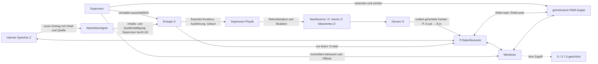

# EVE-Alife – Grundkonzept v0.6

Status: Arbeitsentwurf, noch nicht freigegeben

Stand: 20. September 2026

## 1. Zweck und Statuslogik

Dieses Dokument konsolidiert den bisherigen Konzeptstand einschließlich des am 6. September konkretisierten RAM-Suppen- und Datenflussmodells sowie der Architekturentscheidungen vom 20. September. Es ist noch keine implementierungsfertige Spezifikation. Größen, Codierungen, Taktung, Adressräume, Kosten und Wahrscheinlichkeitsfunktionen bleiben einer späteren Prototyp-Spezifikation vorbehalten.

Die Aussagen sind in vier Klassen getrennt:

- **Entschieden:** gegenwärtig tragendes Modell.
- **Arbeitshypothese:** konkreter Kandidat, der noch geprüft oder verworfen werden kann.
- **Offen:** eine notwendige Festlegung fehlt.
- **Später/inaktiv:** von Anfang an vorzusehen, aber in der Startpopulation oder ersten Ausbaustufe nicht notwendig aktiv.

Frühere Konzepte werden bei Widerspruch nicht gelöscht. Abschnitt 13 führt die Spannungen und Ablösungen ausdrücklich auf.

## 2. Forschungsrahmen

EVE-Alife ist ein offenes Evolutionsexperiment mit extrem primitiven digitalen Entitäten. Der Name verbindet **EVE = Emergent Virtual Evolution** mit **ALife = Artificial Life** und grenzt das Projekt von EVE, der Home-Assistant-Assistentin, ab. Historische Dokumente können weiterhin die frühere Kurzbezeichnung EVE verwenden.

Sprache, menschliche Semantik, Wissen, Neugier, Kooperation, Forschung und Selbsterhaltung werden nicht als fertige Fähigkeiten eingebaut. Auch Stagnation, Exploits und vollständiges Aussterben sind gültige Ergebnisse.

Leitprinzip:

> So wenig wie möglich vorgeben. Alles technisch Unvermeidbare so elementar wie möglich halten.

Die Ausführung bleibt in einer abgeschotteten Versuchsumgebung. Supervisor, Sicherheitsgrenze und technische Schutzlimits liegen außerhalb der Evolution. Isolation wird nicht als gewünschtes Verhalten der Entitäten formuliert, sondern durch die Umgebung erzwungen:

> Isolation ist eine Eigenschaft der Umgebung, keine Verhaltensregel ihrer Bewohner.

Eine Ressource oder Fähigkeit, die nicht erreichbar sein soll, erhält keine technisch nutzbare Schnittstelle. Für die erste Stufe bedeutet dies: definierter Input hinein, Beobachtungsdaten hinaus, kein Internet, kein frei zugängliches Host-Dateisystem, keine Shell und keine erreichbaren Netzwerkdienste. Spätere Erweiterungen der Umweltfläche benötigen jeweils eine bewusste Entscheidung und ein eigenes Threat Model.

Status: **entschieden**.

### 2.1 Experimenteller Kern und Lupe

Alles, was Regeln oder Verhalten des Experiments unmittelbar bestimmt, wird selbst geschrieben und quelloffen veröffentlicht. Dazu gehören insbesondere Supervisor, Weltmodell, Entitäten, Evolution, Mutation, Ressourcenlogik, Interaktionen und Simulationsregeln. Externe Libraries und Frameworks implementieren keine dieser Funktionen.

Programmiersprache, Standardbibliothek, Compiler und Betriebssystem gelten als Infrastruktur. Außerhalb des experimentellen Kerns darf die **Lupe** etablierte Frameworks für Visualisierung, Analyse, Benutzeroberfläche und Datenansicht verwenden. Ihre Schnittstelle zum Kern bleibt schmal, dokumentiert und beobachtend; sie darf das Experiment nicht beeinflussen.

Status: **entschieden**. Die konkrete technische Schnittstelle der Lupe ist **offen**.

## 3. Weltmodell: zuerst die RAM-Suppe

Die für Entitäten zunächst erreichbare gemeinsame Umwelt ist ein vom Supervisor bereitgestellter beziehungsweise reservierter RAM-Bereich, die **RAM-Suppe**. Entitäten interagieren in dieser Stufe nicht mit Dateien, Pfaden, Prozessen oder anderen höherwertigen Betriebssystemkonzepten.

Die RAM-Suppe ist kein simuliertes Dateisystem und keine semantische Weltbeschreibung. Sie ist ein gemeinsamer, flacher Interaktionsraum aus adressierbaren Speicherstellen. Der reale Rechner und das Betriebssystem bleiben technische Träger und Sicherheitsumgebung, sind aber zunächst nicht die wahrnehmbare Umweltfläche der Entitäten.

Entitäten belegen abgegrenzte Bereiche in oder an dieser Suppe. Ihr Inneres ist gegen direkte Zugriffe anderer Entitäten geschützt. Welche freien und belegten Adressen lesbar oder beschreibbar sind, erzwingt der Supervisor.

Status: **entschieden** für die erste Umweltstufe. Die spätere Öffnung weiterer realer Rechnerflächen ist **später/inaktiv**.

## 4. Entität und geschützte Zustände

Eine EVE-Entität besitzt drei logisch getrennte Zustandsbereiche:

- `G`: Genom; vererbbare Ausgangsausstattung und Bauplan des P-Netzes.
- `Z`: beschreibbarer interner Zustand; bei Geburt leer, danach ausschließlich durch die eigene Ausführungsgeschichte aufgebaut.
- `S`: Energie; ausschließlich vom Supervisor gehalten und bilanziert.

`G` und `Z` liegen im geschützten Inneren. `S` gehört logisch zum Energiezustand der Entität und bleibt vollständig unter Kontrolle des Supervisors. Die Entität kann ihren aktuellen eigenen Wert ausschließlich über den primitiven Funktionspunkt `S-read` lesen, aber weder schreiben noch anderweitig manipulieren. `S-read` liefert nur einen Wert; es enthält keine vorgegebene Interpretation oder Hungerreaktion.

Der Supervisor darf `G`, `Z`, `S`, Abstammung und Laufstatus beobachten. Dieses Beobachterwissen wird nicht automatisch in die RAM-Suppe oder Membran eingespeist.

Status: **entschieden**. Größe und Adressierung von `Z` sind **offen**.

## 5. Membran

Die Membran ist das vom Supervisor kontrollierte, adressierbare Interface eines durch eine Entität belegten Speicherbereichs. Sie ist weder eine Kopie des Inneren noch ein allgemeiner Systemaufrufkanal.

Ein Zugriff von außen darf `G`, `Z` oder `S` nicht preisgeben. Der grundlegende Membranwert kann die vom Supervisor vergebene Entity-ID sein. Weitere Offsets können primitive lesbare, schreibbare oder in beide Richtungen nutzbare Interaktionspunkte bereitstellen.

Formal als Arbeitsrahmen:

```text
Membran(e) = { offset -> Zugriffstyp und primitiver Wert }

offset 0             -> Entity-ID                     [Kandidat: lesbar]
offset 1..m          -> primitive Interaktionspunkte [noch festzulegen]
G(e), Z(e), S(e)     -> niemals durch Membranadressierung erreichbar
```

Die Entity-ID als erster Membranwert und die weiteren Offsets sind **Arbeitshypothesen**. Schutz, Supervisor-Kontrolle und Nichtpreisgabe von `G`, `Z`, `S` sind **entschieden**. Semantik, Zahl und Zugriffsrechte der Offsets sind **offen**.

## 6. `P` und das Datenflussnetz

`P` wird nicht als fertiger Befehl, Fähigkeitsname oder skalare Verhaltensneigung verstanden. Ein `P` ist eine **gerichtete Datenflusskante**: die kleinste vererbbare Verschaltung von einem Ausgangsport eines elementaren Funktionspunkts zu einem Eingangsport eines anderen Funktionspunkts:

`P: A.out → B.in`

Der Wert fließt ausschließlich in Pfeilrichtung; die Verbindung ist nicht automatisch umkehrbar. Erst mehrere `P` bilden gemeinsam ein funktionales Datenflussnetz. Verhalten entsteht aus dessen Topologie, den aktuellen Werten in `Z`, der RAM-Suppe und der unveränderlichen Menge primitiver Operationen. Ein einzelnes `P` trägt keine Bedeutung wie „lesen“, „erkunden“ oder „reproduzieren“; seine Wirkung ergibt sich aus den verbundenen Ports und dem übrigen Netz. Nach dieser Definition verwendet das Dokument „Kante“ als Kurzform für „gerichtete Datenflusskante“.

Status: **entschieden** als gegenwärtiges P-Modell. Die exakte Genomcodierung einer Kante, Mehrfachkanten, Porttypen und der Umgang mit ungültigen Verbindungen sind **offen**.

### 6.1 Kandidatensatz primitiver Funktionspunkte

Derzeitiger Kandidatensatz:

```text
Z-read, Z-write, S-read, RAM-read, RAM-write, ADD, SUB, XOR, EQ
```

Die Schreibpunkte reichen den geschriebenen Wert im Datenfluss weiter:

```text
ZWRITE(address, value)   -> value
RAMWRITE(address, value) -> value
```

Der Seiteneffekt verändert den jeweiligen Speicher; der Rückgabewert erlaubt weitere Verschaltung ohne zusätzlichen Kopierbefehl.

Dieser Operationssatz und die genaue Signatur der Punkte sind **Arbeitshypothesen**, keine abschließend festgelegten Opcodes. Insbesondere ist offen, wie mehrstellige Eingänge synchronisiert und Werte getaktet werden.

### 6.2 Minimale prinzipielle Wirkung

Mit dem Kandidatensatz kann ein hinreichend verschaltetes Netz grundsätzlich:

1. aus der Genomtopologie eine erste Aktion und einen ersten Wert hervorbringen,
2. diesen Wert als RAM-Adresse oder Eingabe einer anderen primitiven Operation verwenden,
3. einen Rückgabewert in `Z` schreiben,
4. gespeicherte und aktuelle Werte weiterverarbeiten und
5. dadurch weitere Bereiche der RAM-Suppe untersuchen.

Das ist eine Erreichbarkeitsaussage über die Bausteine, keine Garantie, dass ein zufälliges Startgenom ein solches Netz besitzt oder dass dessen Ausführung bereits eindeutig definiert ist.

## 7. `Z`, individuelle Neuheit und Energiegewinn

`Z` ist bei jeder Geburt leer. Die erste Wirkung geht ausschließlich aus `G` hervor. Erst Rückgabewerte ausgeführter Strukturen können in `Z` geschrieben werden. Damit beschreibt `Z` den erworbenen internen Zustand beziehungsweise die konkrete Lebens- und Erfahrungsgeschichte der Entität, nicht semantisch bereits „Wissen“.

Für die erste Minimalökonomie gilt:

```text
neu_e(z, t) := z war vor Zeitpunkt t noch nicht in Z(e) vorhanden
```

Ein neuer Eintrag in `Z` kann einen vom Supervisor gebuchten Energiegewinn `ΔS` erzeugen. Der Ertrag unterliegt zwei unabhängigen Sättigungseffekten: Wiederholte identische Inhalte liefern zunehmend weniger zusätzliche Energie; ebenso liefern wiederholt aus derselben Quelle gewonnene neue Inhalte zunehmend weniger Energie. Der Supervisor bewertet dabei weder Bedeutung noch Wahrheit noch Nützlichkeit des Werts oder der Quelle.

Als noch nicht festgelegter Funktionsrahmen:

```text
k_e(v, t) = Anzahl früherer Einträge des Werts v in Z(e)
q_e(q, t) = Anzahl früherer Neuheitsereignisse aus Quelle q für e
ΔS        = reward(k_e(v, t), q_e(q, t))

reward(0, 0) > 0
reward(k + 1, q) <= reward(k, q)
reward(k, q + 1) <= reward(k, q)
```

Ob `reward(k, q)` gegen null geht, eine Untergrenze besitzt oder Wiederholungen ab einem Punkt gar nicht mehr belohnt, ist **offen**. Ebenfalls offen sind die stabile, semantikfreie Identität einer Quelle und die Frage, ob „vorhanden“ den aktuellen Inhalt von `Z` oder eine supervisorseitige Lebenszeit-Historie meint; bei Überschreiben führen beide Definitionen zu verschiedenen Ergebnissen.

Die syntaktische Neuheitsregel, Inhalts- und Quellensättigung sowie die semantische Neutralität des Supervisors sind **entschieden**. Die Belohnungsfunktion, Quellenidentität und Buchungsdetails sind **offen**. Diese Minimalökonomie ist eine operative Näherung; sie behauptet nicht, Erkenntnis im anspruchsvollen Sinn von Wahrheit, Vorhersage, Bestätigung oder Reproduzierbarkeit bereits definiert zu haben.

## 8. Energie `S`, Aktivität und Tod

Nur der Supervisor verändert `S`. Mögliche Ursachen einer Buchung sind Standby, ausgeführte primitive Operationen, Speicherzugriffe, neue beziehungsweise wiederholte `Z`-Einträge und Reproduktion.

```text
S_e(t+1) = S_e(t)
           - C_standby(e,t)
           - C_execution(e,t)
           - C_reproduction(e,t)
           + ΔS_Z(e,t)
```

Ein positiver Standbyverbrauch und der Tod bei nicht finanzierbarem nächsten Heartbeat bleiben gesetzt. Der Zusammenhang zwischen Standby, Genomgröße und Aktivierungsintensität bleibt eine Arbeitshypothese; seine bisherige Formel war nie beschlossen.

Über `S-read` kann die Entität ihren aktuellen Energiezustand als elementaren Wert wahrnehmen. Der Supervisor schreibt ihr weder dessen Bedeutung noch eine Reaktion darauf vor. Ob und wie das P-Netz den Wert nutzt, ihn in `Z` speichert oder energieabhängige Strategien hervorbringt, bleibt Evolution. Hunger bezeichnet den dadurch prinzipiell wahrnehmbaren energetischen Druck, nicht eine eingebaute Handlungsregel.

## 9. Formales Gesamtmodell



Die gestrichelte Kante bezeichnet ausdrücklich eine verbotene Offenlegung, keinen Datenfluss.

## 10. Reproduktion und Vererbung

Reproduktion bleibt Supervisor-Physik: Entitäten müssen die reproduktive Konstellation hervorbringen; der Supervisor prüft die formalen Bedingungen, bilanziert Energie und führt Geburt, Rekombination und Mutation aus. Er wählt keine Partner, initiiert keine reguläre Reproduktion und erfindet keinen genetischen Inhalt.

Weiterhin gesetzt sind:

- kein künstlicher Energiebonus durch Reproduktion,
- Startenergie des Kindes aus bilanzierten Quellen, grundsätzlich Elternbeiträgen,
- mindestens zwei aktiv beteiligte kompatible Eltern als gegenwärtiger Grundansatz,
- gemeinsamer realer Elternpool aus `P`,
- Ziehen ohne Zurücklegen entsprechend realer Häufigkeit,
- Mutation nach der Rekombination,
- variable Genomgröße mit der Summe der Elterngenome als Obergrenze des einzelnen Ereignisses.

Mit dem neuen P-Modell bedeutet Rekombination die Vererbung von Kanten beziehungsweise Verschaltungen, nicht fertiger Befehlsfolgen. Noch zu klären ist, wie isolierte Kanten, inkompatible Ports, Netzkomponenten und für Reproduktion notwendige primitive Interaktionspunkte behandelt werden. Die bisherige Behauptung, die relative Häufigkeit eines `P` bestimme zugleich eine allgemeine phänotypische „Ausprägung“, ist für Netzkanten nicht automatisch gültig und wird deshalb als **offen/prüfbedürftig** zurückgestuft. Häufigkeit als Vererbungsgewicht bleibt bestehen.

## 11. Später vorgesehener, zunächst inaktiver Pfad `Z -> G`

Der Pfad von erworbenem Zustand zu Genom soll konzeptionell und technisch von Anfang an möglich bleiben. Er ist keine globale Lernfunktion und kein automatisches Lamarck-Prinzip, sondern eine seltene genomische Disposition `A_ZG`.

Eine mögliche spätere Wirkung ist genetische Assimilation: häufig wiederkehrende Muster in `Z` können unter Kontrolle einer vorhandenen `A_ZG`-Struktur Änderungen in `G` begünstigen. `A_ZG` muss in der Startpopulation nicht vorhanden sein. Sie kann als selten erreichbare Struktur im Genomraum existieren, etwa durch Mutation. Ob sie entsteht, funktionsfähig ist und sich verbreitet, entscheidet die Evolution.

Status: technische Anschlussfähigkeit **entschieden**; Mechanismus **später/inaktiv**. Auslösekriterium, Kosten, Übersetzung von Z-Mustern in P-Kanten, Fehlerrate und Sicherheitsgrenzen sind **offen**.

## 12. Zustandsübersicht

| Bereich | Status | Gegenwärtige Aussage |
|---|---|---|
| RAM-Suppe als erste Umwelt | entschieden | Gemeinsamer supervisor-reservierter RAM; keine Dateien oder Pfade |
| Schutz des Inneren | entschieden | Fremdzugriffe legen `G`, `Z`, `S` nicht offen |
| `S` | entschieden | Supervisorseitig verwaltet; über `S-read` lesbar, niemals schreib- oder manipulierbar |
| `P` | entschieden | Gerichtete Datenflusskante `A.out → B.in`; viele `P` bilden ein Netz |
| primitive Funktionspunkte | Arbeitshypothese | `Z-read/write`, `S-read`, `RAM-read/write`, `ADD`, `SUB`, `XOR`, `EQ` |
| Membranoffset 0 | Arbeitshypothese | Lesbare Entity-ID |
| weitere Membranoffsets | offen | Primitive Lese-/Schreibpunkte und ihre Rechte |
| `Z` bei Geburt | entschieden | Leer; Aufbau ausschließlich durch eigene Ausführungsgeschichte |
| individuelle Neuheit | entschieden | Ein Wert ist neu, wenn er der Entität in `Z` noch nicht begegnet ist |
| Wiederholungsrabatt | entschieden/offen | Abnehmender Mehrertrag; konkrete Funktion offen |
| Quellensättigung | entschieden/offen | Abnehmender Ertrag neuer Inhalte aus derselben Quelle; Funktion und Quellenidentität offen |
| Taktung und Ausführung | offen | Aktivierung, Reihenfolge, Parallelität, Zyklen und Mehrfacheingänge |
| Z-Adressierung | offen | Wertebreite, Grenzen, ungültige Adressen, direkt/indirekt |
| Reproduktion | entschieden + offen | Supervisor-Physik bleibt; netzspezifische Validität noch zu bestimmen |
| `A_ZG` | später/inaktiv | Seltene evolvierbare Disposition zur möglichen genetischen Assimilation |
| OS-Erweiterungen | später/inaktiv | Dateien, Pfade und andere Systemflächen erst nach der RAM-Stufe |
| Isolation | entschieden | Nicht erlaubte Fähigkeiten besitzen keine technisch nutzbare Schnittstelle |
| Abhängigkeiten | entschieden | Eigenproduktion im kausalen Kern; Fremdcode nur als Infrastruktur oder beobachtende Lupe |

## 13. Abgleich mit dem bisherigen Stand

### 13.1 Bestätigt oder konkretisiert

- Die Trennung von `G`, `Z` und `S`, die externe Sicherheitsgrenze und die Rolle des Supervisors bleiben bestehen.
- Die Sicherheitsgrenze wird präzisiert: Isolation ist eine technische Eigenschaft der Umgebung, keine Verhaltensregel für Entitäten.
- Der kausale experimentelle Kern wird als quelloffene Eigenproduktion festgelegt; Fremdcode bleibt auf Infrastruktur und die beobachtende Lupe begrenzt.
- Das am 29. August nur diskutierte Netzbild wird zum gegenwärtigen P-Modell konkretisiert.
- Die Membran bleibt Umweltbestandteil, wird aber nun als adressierbares Interface eines belegten Bereichs präzisiert.
- Reproduktion, Energieerhaltung, Rekombination und Mutation bleiben Supervisor-Physik.
- Die alte Bytecode-Runtime mit Instruction Pointer und Registern bleibt abgelöst.

### 13.2 Widersprüche und bewusste Verschiebungen

1. **Reale Linux-Umwelt gegen anfängliche RAM-Suppe:** Frühere Texte nennen Dateien, Prozesse, Zeit und Geräte als unmittelbare Welt. Jetzt ist nur die RAM-Suppe die erste erreichbare Umwelt. Auflösung: Linux bleibt Träger und mögliche spätere Umwelt, ist aber anfangs nicht exponiert.
2. **„Erkenntnis ist Nahrung“ gegen syntaktische Z-Neuheit:** Bisher verlangte Energiegewinn neue, überprüfte, reproduzierbare und valide Erkenntnis; bloße Information sollte nicht genügen. Jetzt genügt zunächst ein in `Z` neuer Eintrag, ohne Wahrheits- oder Nützlichkeitsprüfung. Das ist ein echter Modellwechsel für die erste Minimalökonomie. Die anspruchsvollere Erkenntnisökonomie bleibt Forschungsziel beziehungsweise spätere Ausbaustufe, nicht aktive Bewertungsregel dieses Modells.
3. **`P` als gewichtete Disposition gegen `P` als Kante:** Die allgemeine Aussage, relative Kopienhäufigkeit bestimme die Ausprägung eines `P`, folgt für Netzkanten nicht mehr ohne Zusatzregel. Sie wird nicht übernommen; nur die Häufigkeit im Rekombinationspool bleibt gesetzt.
4. **Hunger und `S`:** Die zwischenzeitliche Festlegung eines vollständig verborgenen `S` widersprach dem gesetzten Hunger als evolvierbarem energetischem Druck. Auflösung: Nur der Supervisor schreibt `S`; `S-read` macht den aktuellen Wert wahrnehmbar, ohne Interpretation oder Reaktionsregel vorzugeben.
5. **`Z` geht mit dem Tod verloren gegen `Z -> G`:** Die Grundregel bleibt, dass `Z` nicht direkt vererbt wird. `A_ZG` ist eine seltene, genetisch disponierte Transformation vor oder bei Reproduktion und keine automatische Übertragung von `Z`.
6. **Eigenständiger OS-Prozess gegen belegter RAM-Bereich:** Der frühere formale Begriff definierte jede Entität als eigenständige Prozesseinheit. Das RAM-Suppen-Modell benötigt diese Identität nicht zwingend. Ob Entitäten technisch Prozesse, Tasks oder supervisorverwaltete Speicherobjekte sind, ist wieder offen und prototypspezifisch.

## 14. Zentrale offene Fragen vor einer Prototyp-Spezifikation

1. Welche Ausführungs- und Taktsemantik aktiviert Kanten und Funktionspunkte? Was geschieht bei Zyklen, konkurrierenden Schreibzugriffen oder fehlenden Eingängen?
2. Wie ist `Z` adressiert, wie breit sind Adresse und Wert, und was bewirken ungültige Zugriffe?
3. Bezieht sich Neuheit auf den aktuellen Z-Inhalt oder eine nicht sichtbare Lebenszeit-Historie? Wann genau wird `ΔS` gebucht?
4. Welche abnehmenden Funktionen gelten für Inhalts- und Quellensättigung, wie werden sie kombiniert, und wie wird eine Quelle semantikfrei identifiziert?
5. Welche Membranoffsets existieren außer der Entity-ID, und wie können daraus Interaktion und Reproduktion entstehen?
6. Wie werden Ausführungs-, RAM-, Standby- und Reproduktionskosten bilanziert?
7. Wie wird ein reproduktiver Zustand aus dem P-Netz ausgedrückt, ohne einen fertigen Verhaltensbefehl einzubauen?
8. Welche Bedeutung haben doppelte identische Kanten im Genom und bei der Ausführung?
9. Wie kann das P-Netz `S-read` nutzen, ohne dass eine Hungerinterpretation oder Reaktion vorgegeben wird?
10. Wie bleibt der spätere `Z -> G`-Pfad technisch erreichbar, ohne in der Startstufe versehentlich aktiv zu sein?
11. Wie wird die einseitige Beobachtungsschnittstelle der Lupe konkret gestaltet und nachweisbar vom kausalen Kern getrennt?
