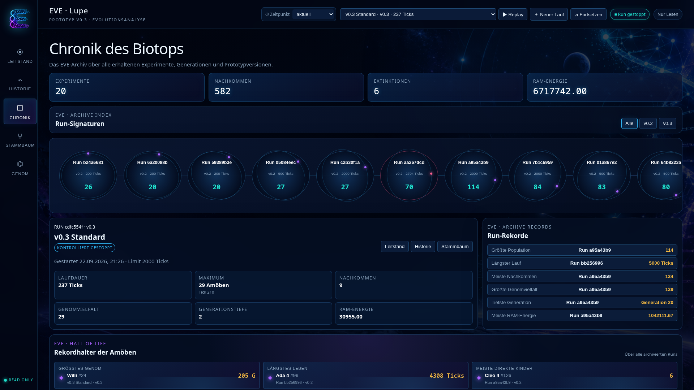

# Die Lupe in Prototyp v0.3

Die Lupe ist die read-only Analyseoberfläche von EVE-Alife. Sie liest laufende
und archivierte Runs, verändert aber weder Simulation noch Run-Daten. Start,
Stopp und Fortsetzung gehören dem getrennten Supervisor.

## Arbeitsbereiche

### Leitstand

Der Leitstand beobachtet den gewählten Run. Das lineare RAM-Band kann gezoomt
und durch Ziehen im leeren Bereich horizontal verschoben werden. Amöben werden
erst dann gruppiert, wenn ihre Markierungen im aktuellen Zoomlevel überlappen.
Identische RAM-Positionen bleiben als auswählbare Gruppe erhalten.

Die Run-Auswahl lädt auch konservierte v0.2-Runs. Das Replay spielt gespeicherte
Beobachtungsbilder ab und ist ausdrücklich kein exakter Tick-Replay.

### Historie

Der Evolutionsverlauf zeigt Population, Genomvielfalt, Geburten, Tode und
laufübergreifend konsistente Schlüsselereignisse. Ziehen wählt einen Zeitraum,
das Mausrad zoomt und Umschalt-Ziehen verschiebt die sichtbare Zeitachse.

Die Amöbenliste unterstützt mehrere kommagetrennte Suchbegriffe als ODER-Suche,
beispielsweise `Ada, Vera, #99`. Suchbegriffe erscheinen als einzeln entfernbare
Chips; nicht gefundene Begriffe werden kenntlich gemacht.

### Chronik

Die Chronik ist das versionsübergreifende EVE-Archiv. Sie führt v0.2 und v0.3
zusammen, ohne ihre Versuchsreihen fachlich gleichzusetzen. Run-Signaturen,
Run-Dossiers, Versionsfilter, Run-Rekorde und ein Zwei-Run-Vergleich erschließen
das Archiv. Die „Hall of Life“ bewahrt die Rekordhalter einzelner Amöben und
öffnet auf Klick den zugehörigen Run und Historieneintrag.

### Stammbaum

Der Stammbaum ist eine evolutionäre Zeitlandschaft. Er zeigt Elternkanten,
Generationen, Lebensstatus, Genomänderungen und Schlüsselereignisse. Beim
Anklicken einer Amöbe bildet eine Verwandtschaftslinse ihre Vorfahren links und
ihre Nachkommen rechts ab. Vorfahren erscheinen cyan, Nachkommen violett.

Umschalt-Klick vergleicht zwei Amöben und ermittelt ihren letzten gemeinsamen
Vorfahren. Mausrad und Ziehen steuern den zweidimensionalen Arbeitsraum. Ein
Klick auf freie Fläche löst den Fokus und stellt die vorherige Kameraposition
wieder her; `Gesamt` kehrt bewusst zur vollständigen Zeitlandschaft zurück.

### Genom

Die Genomanalyse stellt Funktionspunkte, Ports und gerichtete Verbindungen als
EVE-Netzkarte dar. Klick auf einen Funktionspunkt hebt seine direkten Beziehungen
hervor und blendet Unbeteiligtes ab. Der Arbeitsraum kann zweidimensional
verschoben und bis 64-fach gezoomt werden. Eine Genomkarte lässt sich weiterhin
in einem separaten Fenster öffnen.

## Fokusmodus

Stammbaum und Genom besitzen einen gemeinsamen Fokusmodus. `Vergrößern`, die
Taste `F` und `Esc` schalten ihn. Navigation und Lupensteuerung bleiben sichtbar,
der Seiten-Scrollbalken verschwindet und die Analyse nutzt den restlichen
Bildschirm. Die Präferenz bleibt beim Wechsel zwischen den Arbeitsbereichen und
innerhalb der Browsersitzung erhalten. Zoom, Position und Auswahl werden nicht
neu initialisiert.

## Run-Steuerung und Beobachtungsgrenze

Die Lupe sendet ausschließlich explizite Start-, Stopp- und Fortsetzungsaufträge
an den Supervisor auf Port 8767. Ein kontrollierter Stopp wird vom Supervisor
ausgeführt und als `user_requested` finalisiert. Eine Fortsetzung erzeugt immer
einen neuen, verknüpften Run; der alte Run bleibt unverändert.

Gespeicherte Beobachtungen liegen je nach Konfiguration nicht für jeden Tick
vor. Historische Zustände zwischen zwei Beobachtungen werden deshalb nicht
erfunden. Protokollierte Ereignisse und automatisch erkannte Auffälligkeiten
werden in Tooltips unterschieden.

## Start

```bash
cd 04_Prototypen/v0.3
python3 supervisor.py
python3 lupe.py runs/DEINE-RUN-ID --port 8766
```

Die Lupe ist anschließend unter `http://127.0.0.1:8766/` erreichbar.

## Screenshots

Die folgenden Aufnahmen zeigen den Stand vom 22. September 2026 bei einer
Viewport-Größe von 1920 × 1080:

- [Leitstand](screenshots/01-leitstand.png)
- [Historische Analyse](screenshots/02-historie.png)
- [Chronik des Biotops](screenshots/03-chronik.png)
- [Stammbaum im Fokusmodus](screenshots/04-stammbaum-fokus.png)
- [Genom-Analyse im Fokusmodus](screenshots/05-genom-fokus.png)


