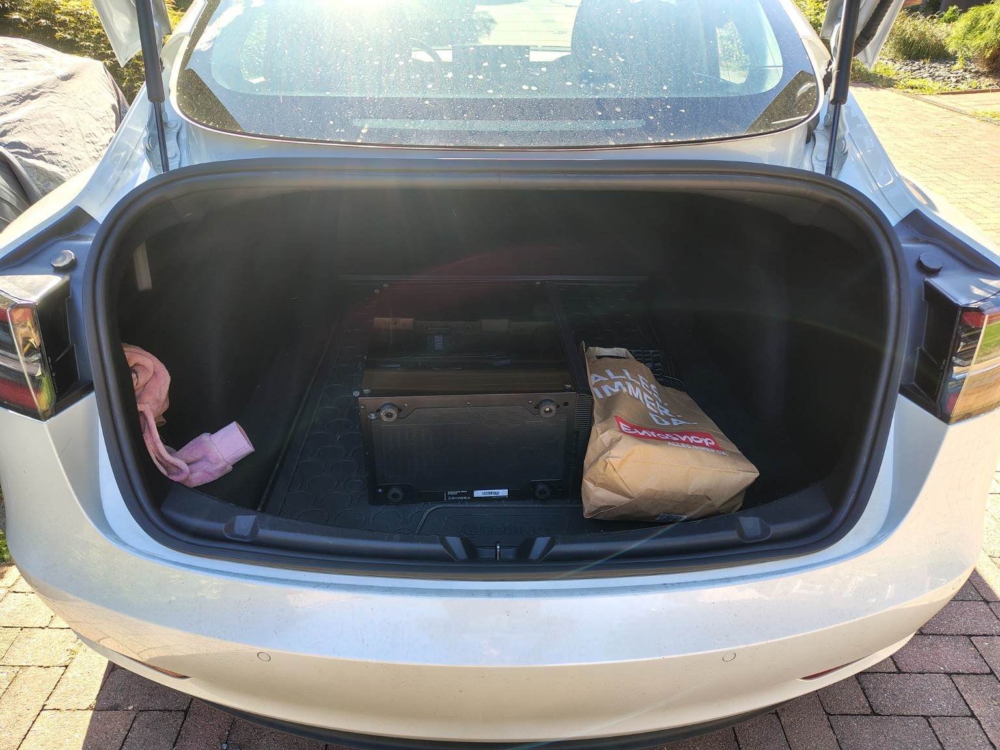
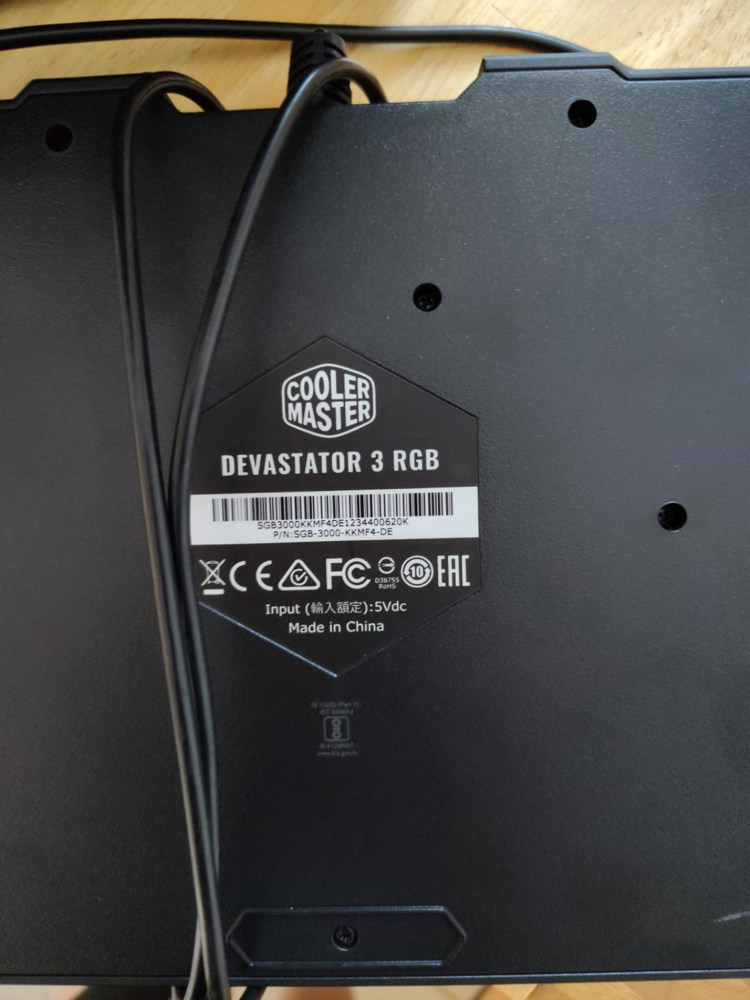

# Bergung und Namensgebung

Datum: 28. August 2026
Quelle: gemeinsamer Chat „Biotop Eimer eingesammelt“
Quell-ID: `6a91a59f-f320-83eb-80d2-9cabdb404868`

## Vom Gedanken zum Gegenstand

Am 28. August 2026 wechselte das KI-Biotop seinen Zustand von „wir könnten einmal“ zu „die Hardware steht tatsächlich im Kofferraum“. Der gebrauchte Rechner wurde abgeholt und zusammen mit Monitor, Tastatur und Maus ins Arbeitszimmer im Dachgeschoss gebracht.

Das Gehäuse wurde als Ventum 200 ARGB identifiziert. Im Projektjargon war der Rechner zu diesem Zeitpunkt allerdings bereits der **Biotop-Eimer**. Die Bergung fand artgerecht im Tesla statt; die auf dem Foto sichtbare Backwarentüte gehört zur historischen Quellenlage. Später diente eine weitere Papiertüte als hochspezialisierte EDEKA-Peripherietransporteinheit.

> 28. August 2026 – Bergung des ersten KI-Biotops aus freier Wildbahn. Versorgung der Forscher durch Backwaren sichergestellt.

## Verbringung an den Forschungsstandort

Der Rechner, ein MSI-Display und die Peripherie wurden ins Dachgeschoss transportiert. Wegen der Augustwärme wurde zuvor die Klimaanlage eingeschaltet – standesgemäß über eine in Home Assistant weiterhin „Weihnachtsbaumbeleuchtung“ genannte Steckdose.

Der Schreibtisch wurde umgebaut: Zwei Dell-Displays sollten einem Ultrawide weichen, damit EVE sichtbar auf dem Tisch statt darunter stehen konnte. Damit war die physische Bergung abgeschlossen und der „Eimer“ bereit für seine technische Bestandsaufnahme.

## Mitgelieferte Ausstattung

Der mitgelieferte Bildschirm wurde als MSI PRO MP273A identifiziert: 27 Zoll, Full HD und 100 Hz.

Die Tastatur gehört zum kabelgebundenen Cooler-Master-Devastator-3-RGB-Set mit deutschem Layout. Zusammen mit der Maus stand damit ein vollständiger Arbeitsplatz zur Verfügung.

## Der Eimer bekommt einen Namen

Am Ende des Gesprächs entstand die Kurzbezeichnung des Projekts:

**Projektname:** EVE
**Langform:** Emergent Virtual Evolution
**Beschreibung:** Das KI-Biotop

Der Name verbindet mehrere Ebenen: EVE klingt nach Anfang und Ursprung, Evolution steckt unmittelbar darin, und die Langform beschreibt den Ansatz. Wir wollen nicht das gewünschte intelligente Verhalten programmieren, sondern Bedingungen schaffen und beobachten, was evolutionär daraus entsteht.

> Der Eimer hat einen Namen.

Damit begann die eigentliche Geschichte von EVE nicht mit einer Codezeile, sondern mit einem gebrauchten Rechner im Kofferraum, Backwaren und der Frage, was wohl passiert, wenn man ihn einfach machen lässt.
