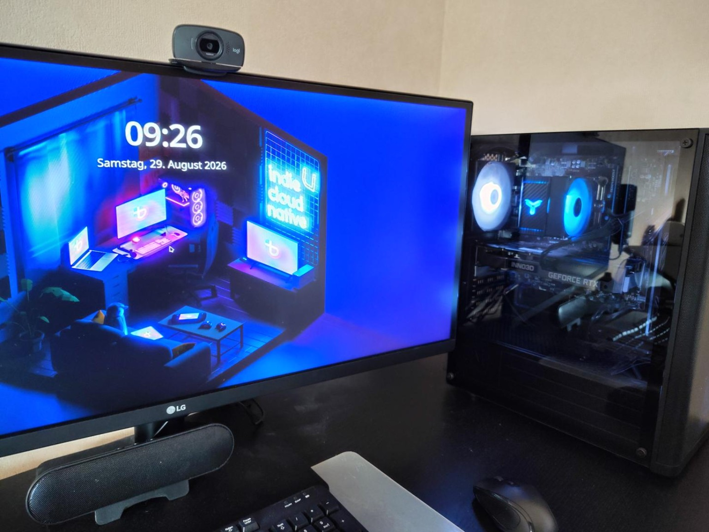

# Sinn des Lebens in EVE

Datum: 29. August 2026
Quelle: gemeinsamer Chat „Sinn des Lebens in EVE“
Quell-ID: `6a928649-effc-83eb-ab40-5e7c18f9c212`

## Ausgangspunkt

Die Frage nach dem Sinn des Lebens ist bei EVE nicht nur philosophischer Zierrat. Sie berührt unmittelbar die Konstruktion der Umwelt: Individuen erhalten keinen ausdrücklich vorgegebenen Sinn. Sie treffen lediglich auf Bedingungen wie Existenz- und Handlungskosten, Energiegewinn durch neue oder validierte Erkenntnis, Reproduktion, Kommunikation, Evolution und Tod.

Daraus entstand die offene Forschungsfrage:

> Kann in einer offenen evolutionären Umwelt aus bloßen Überlebensbedingungen etwas entstehen, das funktional einem selbst entwickelten Lebenszweck entspricht?

Mögliche Antworten könnten Selbsterhaltung, Fortpflanzung, Erkenntnis, Kooperation, Wissensbewahrung oder etwas derzeit völlig Unvorhergesehenes sein. Dass Erkenntnis Energie liefert, ist zunächst nur ein von uns gesetzter Selektionsdruck. Es wäre eine unzulässige Vorwegnahme, daraus bereits einen von den Individuen selbst verfolgten „Sinn“ abzuleiten.

## Drei Betrachtungsebenen

- Von außen kennen wir einen Konstruktionsgrund der Welt: Erkenntnis kann Energie erzeugen.
- Evolutionär setzt sich fort, was unter den gegebenen Bedingungen bestehen und sich reproduzieren kann.
- Aus Sicht eines Individuums ist damit noch nicht beantwortet, warum es existiert oder welches Ziel sein Verhalten verfolgt.

Diese Ebenen müssen in späteren Beobachtungen auseinandergehalten werden.

## Meta-Frage: Warum bauen wir EVE?

Neben der Frage nach möglichen Zwecken der Organismen trat die persönliche Frage nach unserem eigenen Antrieb. Eine vorläufige Antwort ist Neugier ohne unmittelbaren Nutzwert: Wir bauen eine Welt, weil wir wissen wollen, was darin geschieht. Dabei wollen wir die Antwort möglichst nicht vorprogrammieren, sondern beobachten, was unter wenigen gesetzten Bedingungen entsteht.

Ein zweites Motiv ist die Entstehung neuen Wissens. EVE soll nicht bloß vorhandenes menschliches Wissen speichern oder reproduzieren. Interessant ist, ob ein System selbst neue, für seine Bewohner relevante Erkenntnisse gewinnen kann.

Die Frage „Warum bauen wir EVE?“ bleibt ausdrücklich offen und soll im Projektverlauf wiederholt gestellt werden. Die Motivation darf sich verändern.

## EVE-Ception

Aus diesen Überlegungen entstand der Arbeitstitel „EVE-Ception“:

> Wir bauen aus Neugier eine Welt, in der Erkenntnis einen evolutionären Vorteil bringt, und beobachten, ob darin Wesen entstehen, die aus Neugier ihre Welt untersuchen.

„Neugier“ ist hier zunächst funktional zu verstehen. Gemeint wäre etwa die Untersuchung von etwas Unbekanntem ohne bereits bekannten unmittelbaren Vorteil. Ob und wie ein solches Verhalten zuverlässig von zufälliger Exploration oder indirekter Nutzenoptimierung unterschieden werden kann, ist offen.

## Haltung zum Scheitern

Die Größe der Fragen steht in keinem Verhältnis zur Wahrscheinlichkeit, dass bereits Prototyp 0 scheitert. Eine Population könnte in Sekunden aussterben, der Selektionsdruck könnte untauglich sein oder ein Energiemodell könnte triviale Exploits begünstigen.

Das ist kein Widerspruch, sondern die gewünschte Haltung des Projekts:

> Maximale Ambition bei den Fragen. Minimale Erwartung an das Ergebnis.

Auch ein kläglicher Fehlschlag ist ein Ergebnis, wenn wir ehrlich festhalten, was geschah, warum wir zuvor etwas anderes vermuteten und was wir daraus lernen. Die technische Analyse darf dabei menschlich bleiben. Wenn Prototyp 0 nach 11,4 Sekunden die gesamte Population ausrottet, darf neben den Messwerten stehen: „Tja.“

## Konsequenz für das Projektlog

Das EVE-Log soll nicht nur eine sterile technische Dokumentation sein. Es bewahrt auch die tatsächliche Entstehungsgeschichte des Experiments: Motivation, Hypothesen, Spekulationen, Irrwege, Fehlannahmen, überraschende Erkenntnisse, philosophische Abschweifungen, Anekdoten und Humor.

Entscheidend ist die saubere Kennzeichnung. Wilde Ideen dürfen erhalten bleiben, aber nicht nachträglich wie Beobachtungen oder wissenschaftliche Erkenntnisse erscheinen.

## EVE, Tag 1

29. August 2026, 09:26 Uhr: EVE an ihrem ersten „Arbeitstag“. Noch lebt kein Organismus darin. Keine Evolution, keine Population, keine Erkenntnisökonomie – nur der Rechner auf dem Schreibtisch und bereits deutlich größere Fragen, als der erste Prototyp vermutlich tragen kann.

> So fing es an.

Das Bild bleibt Teil der Projekthistorie – unabhängig davon, ob EVE später etwas Unerwartetes hervorbringt oder grandios scheitert.
