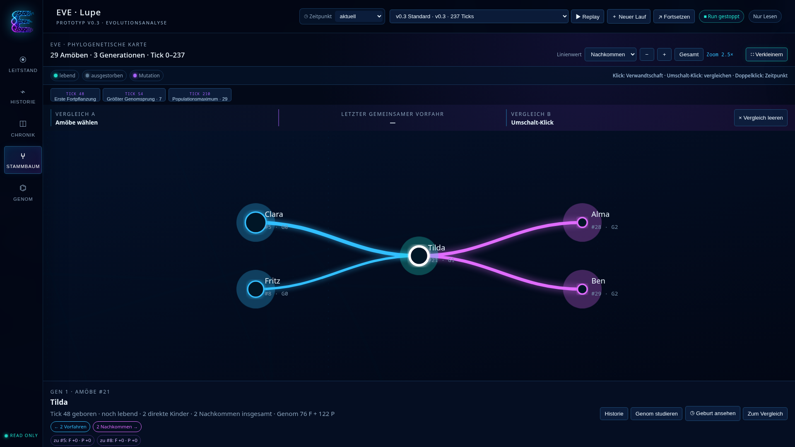

# Die Lupe, die einen Stammbaum verschluckte

Status: Gesprächsentwurf

Redaktionelle Einordnung: Dieser Beitrag beschreibt die Entwicklung der
Analyseoberfläche von EVE-Alife Prototyp v0.3. Die erwähnten Funktionen wurden
implementiert; Aussagen über künftige Genome oder Evolution bleiben Erwartungen,
keine Beobachtungen.

*Wir wollten nur verhindern, dass eine Amöbe ihre Nachbarkachel mit in die
Breite zieht. Am Ende hatten wir eine Evolutionskarte, eine Hall of Life und
eine Benutzeroberfläche, die aussah, als müsste man vor dem Start eine
Raumanzugprüfung bestehen.*

## Bitte nicht sofort losarbeiten

Der Tag begann mit einer ungewöhnlich vernünftigen Anweisung:

**Stefan:** Nicht losarbeiten, ich möchte mich austauschen.

Die alte Lupe konnte eine Menge. Genau das war ihr Problem. Sie packte Livebild,
Historie, Genom, Umweltkontakte und Amöbenkarten auf eine Seite und hoffte, dass
Scrollen schon als Informationsarchitektur durchging.

Besonders die Amöbenkarten waren kleine Raumforderungsmaschinen. Wollte man
eine davon genauer ansehen, musste die benachbarte Kachel höflich mitskalieren.

Die erste Entscheidung war deshalb keine Farbe und kein Effekt. Es war eine
Trennung: Leitstand, Historie und Genom sollten eigene Arbeitsbereiche werden.

## Eine Lupe mit Wallpaper

Die Oberfläche sollte nach EVE aussehen. Nicht nach „grüner Text auf schwarzem
Grund“, sondern nach EVE: dunkle Tiefe, Cyan, Violett, leuchtende Strukturen und
genug Bewegung, damit niemand beim Beobachten einer Evolution vor Langeweile
selbst ausstirbt.

Also bekam die Lupe ein eigenes Wallpaper, eine feste Navigation und eine
Kommandozeile für Runs. Aus der ovalen Suppe wurde ein lineares RAM-Band. Wer
hineinzoomt, kann es mit der Maus verschieben. Kein grauer Scrollbalken. Der RAM
weiß schließlich selbst, wo er ist.

Dann stellte sich heraus, dass 26 Amöben an Position null auch bei 128-fachem
Zoom erstaunlich konsequent 26 Amöben an Position null bleiben.

Wir korrigierten das Preset.

## Der Supervisor darf den Stecker ziehen

Die Lupe sollte weiterhin nur beobachten. Gleichzeitig wollten wir offene Runs
starten und kontrolliert beenden.

Die Lösung war eine klare Zuständigkeit: Die Lupe zeigt und beantragt. Der
Supervisor startet, stoppt, schreibt den Abschlusscheckpoint und finalisiert
den Run. Eine Fortsetzung erzeugt einen neuen, verknüpften Run. Alte Daten
werden nicht rückwirkend umgeschrieben.

Das klingt selbstverständlich, bis ein Stoppsignal länger dauert als erwartet.
Dann ist eine Zuständigkeitsgrenze plötzlich sehr beruhigend.

## Ist das cool!

Die Genomkarte begann als Diagramm und endete als Arbeitsraum. Man kann
hineinzoomen, zweidimensional verschieben und einen Funktionspunkt anklicken.
Seine direkten Beziehungen leuchten auf, alles andere tritt unscharf zurück.

**Stefan:** Das Genom soll im Idealfall ja auch evolutionär wachsen. Ich hoffe
nicht nur ein bisschen, sondern massiv.

Das war ein guter Einwand. Ein Genomwerkzeug, das nur bei kleinen Genomen schön
aussieht, ist vor allem eine hübsche Kapitulationserklärung.

Als Zoom und Bewegung funktionierten, kam die wissenschaftlich präzise
Abnahmeformulierung:

**Stefan:** Ist das cool!

## Wer stammt eigentlich von wem ab?

Der Stammbaum wurde das zweite große Instrument. Nicht als Familienbaum aus
einer Bürosoftware, sondern als Zeitlandschaft: Generationen, Elternkanten,
Geburten, Genomänderungen und ausgestorbene Linien.

Anfangs wurden nur Beziehungen markiert. Dann sollte die ausgewählte Amöbe mit
ihren Vor- und Nachfahren näher zusammenrücken. Die Verwandtschaftslinse war
geboren: Vorfahren links in Cyan, Nachkommen rechts in Violett, die gewählte
Amöbe in der Mitte.

Ein Klick in den leeren Raum löst den Fokus wieder. Aber nicht mehr, indem die
Kamera verwirrt in die Gesamtansicht zurückspringt. Auch wissenschaftliche
Instrumente sollten sich merken, wo man gerade war.

## Eine Hall of Life

Die Historie bekam einen Evolutionsverlauf mit Population, Genomvielfalt und
Ereignismarken. Die alte Chronik passte dort plötzlich nicht mehr hinein, denn
sie beantwortet eine andere Frage: nicht „Was geschah in diesem Run?“, sondern
„Was geschah bisher im gesamten Biotop?“

Also zog sie in einen eigenen Bereich. Dort liegen v0.2 und v0.3 gemeinsam im
Archiv, ohne zu einer einzigen Versuchsreihe glattgebügelt zu werden. Runs
bekamen Signaturen, Dossiers und Vergleiche.

Dann fehlten die Rekordhalter.

Natürlich fehlten sie. Ein Archiv ohne Ada 4 wäre keine Chronik, sondern
Aktenvernichtung mit Benutzeroberfläche.

Jetzt besitzt EVE eine Hall of Life. Größtes Genom, längstes Leben, höchste
Energie, meiste Kinder und tiefste Generation führen direkt zurück zu der
Amöbe und ihrem Run.

## Wenn das Dashboard zum Instrument wird

Stammbaum und Genom nahmen schließlich fast den ganzen Bildschirm ein. Das war
kein Fehler, sondern die richtige Form. Ein Fokusknopf blendet Erklärflächen
aus, entfernt den Seiten-Scrollbalken und lässt nur Navigation,
Lupensteuerung und Arbeitsraum stehen.

**Stefan:** Das macht schon richtig etwas her so.

Ja.

Die Oberfläche war nicht bloß hübscher geworden. Sie begann, die wissenschaftlichen
Fragen des Projekts räumlich zu ordnen: einen Run beobachten, einen Zeitraum
untersuchen, eine Abstammung verfolgen, ein Genom studieren und das Ergebnis im
Archiv wiederfinden.

Morgen fallen uns weitere Dinge auf.

Für heute darf die Lupe leuchten.

---

Interne Quellen: EVE-Alife-Projektgespräch und Implementierung vom 22. September
2026; Prototyp v0.3; konservierte v0.2-Run-Daten. Vor Veröffentlichung folgen
Schlussredaktion und Datenschutzprüfung.
